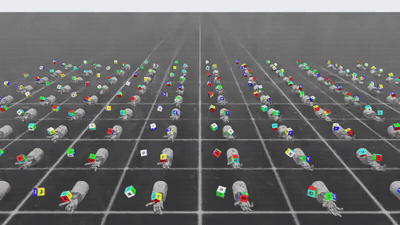
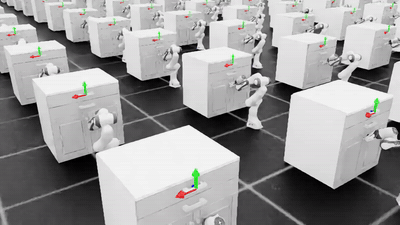
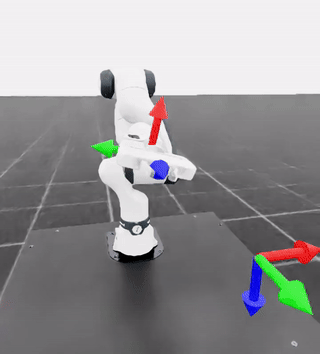
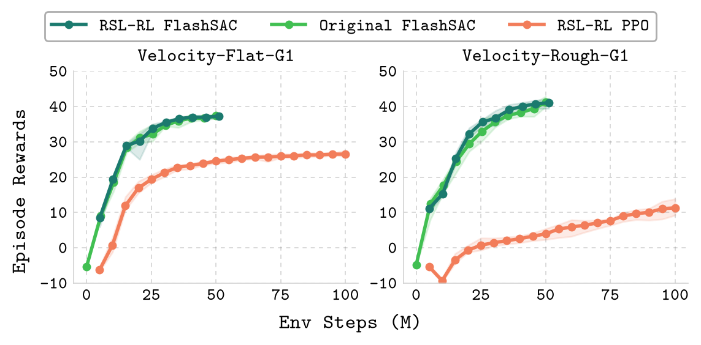
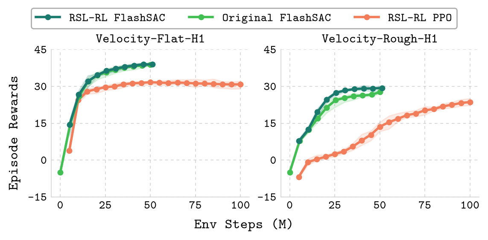
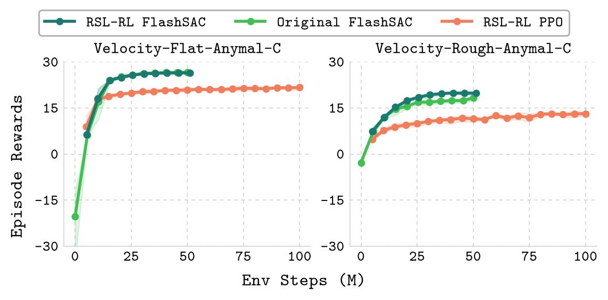
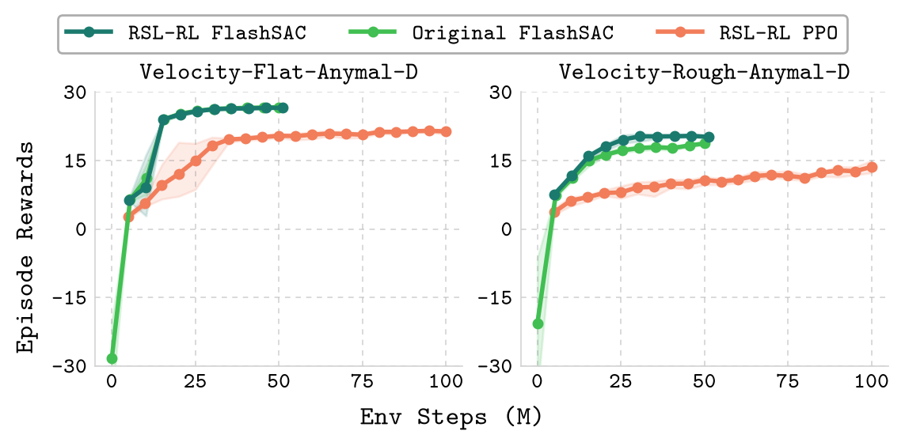
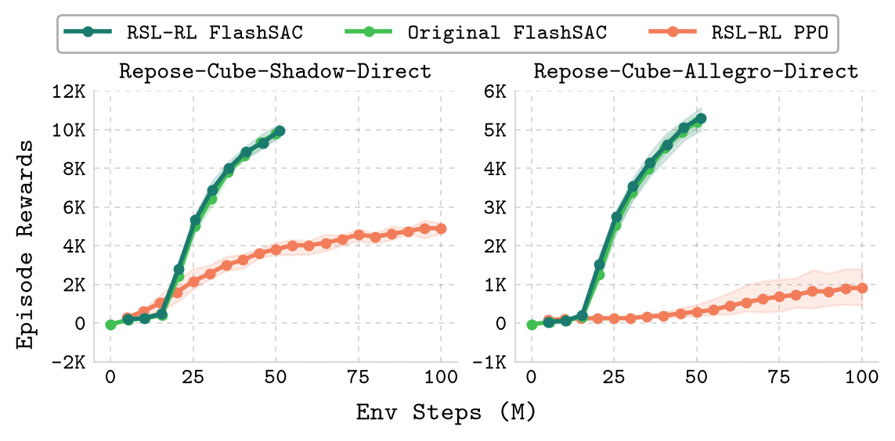
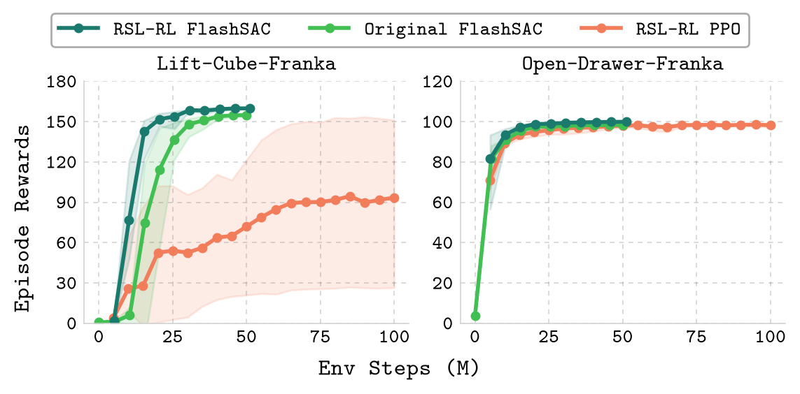

# RSL-RL-FlashSAC

[](https://holiday-robot.github.io/FlashSAC/)
[](https://arxiv.org/abs/2604.04539)

RSL-RL Implementation of **FlashSAC** for [IsaacLab](https://isaac-sim.github.io/IsaacLab/). No forks: [`IsaacLab`](https://isaac-sim.github.io/IsaacLab/) and [`rsl_rl`](https://github.com/leggedrobotics/rsl_rl) are consumed as
upstream dependencies; this repository only adds the FlashSAC extension layers.

<table><tr><td>
  <strong>FlashSAC: Fast and Stable Off-Policy Reinforcement Learning for High-Dimensional Robot Control.</strong><br />
  <small></small>Donghu&nbsp;Kim<sup>1*</sup>, Youngdo&nbsp;Lee<sup>23*</sup>, Minho&nbsp;Park<sup>2</sup>, Kinam&nbsp;Kim<sup>2</sup>, Takuma&nbsp;Seno<sup>4</sup>, I&nbsp;Made&nbsp;Aswin&nbsp;Nahrendra<sup>3</sup>, Sehee&nbsp;Min<sup>1</sup>, Daniel&nbsp;Palenicek<sup>56</sup>, Florian&nbsp;Vogt<sup>7</sup>, Danica&nbsp;Kragic<sup>7</sup>, Jan&nbsp;Peters<sup>568</sup>, Jaegul&nbsp;Choo<sup>2</sup>, and&nbsp;Hojoon&nbsp;Lee<sup>1</sup><small>

</td></tr>
</table>
<sup>1</sup><em>Holiday Robotics</em>, <sup>2</sup><em>KAIST</em>, <sup>3</sup><em>KRAFTON</em>, <sup>4</sup><em>Turing Inc</em>, <sup>5</sup><em>TU Darmstadt</em>, <sup>6</sup><em>hessian.AI</em>, <sup>7</sup><em>KTH Royal Institute of Technology</em>, <sup>8</sup><em>German Research Center for AI (DFKI)</em>, <sup>*</sup><em>Equal Contribution</em>

## 🎬 Demo

### Basic IsaacLab Tasks

<table>
  <tr>
    <th>Velocity Rough G1</th>
    <th>Velocity Rough Anymal-D</th>
  </tr>
  <tr>
    <td width="50%"></td>
    <td width="50%"></td>
  </tr>
  <tr>
    <th>Repose Cube Shadow</th>
    <th>Open Drawer Franka</th>
  </tr>
  <tr>
    <td width="50%"></td>
    <td width="50%"></td>
  </tr>
</table>

### Sim-to-Real Locomotion (Unitree G1 DreamWaQ)

Rough-terrain locomotion (`Isaac-Velocity-Rough-G1-Dreamwaq-v0`): [DreamWaQ](https://arxiv.org/abs/2301.10602)-style observations with a CENet history estimator for base velocity, trained with FlashSAC over a stair / box / wave terrain curriculum.

<table>
  <tr>
    <th>Walking</th>
    <th>Turning</th>
    <th>Push Perturbation</th>
    <th>Stair (15cm)</th>
  </tr>
  <tr>
    <td width="25%"></td>
    <td width="25%"></td>
    <td width="25%"></td>
    <td width="25%"></td>
  </tr>
</table>

### Whole-Body Motion Tracking (Unitree G1 BeyondMimic)

[BeyondMimic](https://beyondmimic.github.io/)-style whole-body motion tracking (`Isaac-Tracking-Flat-G1-v0`, see [Motion Tracking](#motion-tracking-g1-beyondmimic-style)): every environment tracks a retargeted reference clip.

<table>
  <tr>
    <th><code>cr7_celebration</code></th>
    <th><code>dance1_subject2</code></th>
  </tr>
  <tr>
    <td width="50%"></td>
    <td width="50%"></td>
  </tr>
</table>

### End-Effector Reaching (Franka FR3)

Pose reaching on a Franka Research 3 (`Isaac-Reach-Franka-v0`): the stock Isaac Lab reach task retargeted to the FR3, driven by relative joint-position deltas and held inside the arm's torque and velocity limits.

<table>
  <tr>
    <th>Simulation</th>
    <th>Real</th>
  </tr>
  <tr>
    <td width="50%"></td>
    <td width="50%"></td>
  </tr>
</table>

## Benchmark

This implementation reproduces the official FlashSAC IsaacLab benchmark: 12 tasks (velocity locomotion, dexterous in-hand reposing, Franka manipulation) trained for 50M environment steps at 1024 parallel environments, using the single hyperparameter set shared across all tasks from the paper. 

<table>
  <tr>
    <td width="50%"></td>
    <td width="50%"></td>
  </tr>
  <tr>
    <td width="50%"></td>
    <td width="50%"></td>
  </tr>
  <tr>
    <td width="50%"></td>
    <td width="50%"></td>
  </tr>
</table>

Official baseline curves (FlashSAC, PPO, FastTD3) are included under [`results/isaaclab/`](results/isaaclab/).

## Repository Structure

```
rsl_rl_flashsac
  ├── rsl_rl_flashsac        # Algorithm layer on rsl-rl — usable without Isaac Lab
  │   ├── algorithms         # FlashSAC update (categorical double critic, weight norm, AMP, torch.compile)
  │   ├── models             # Actor and distributional critic
  │   ├── modules            # BatchNorm-embedded residual trunk and layers
  │   ├── runners            # OffPolicyRunner
  │   ├── storage            # Uniform / memory-efficient replay buffers (n-step)
  │   └── utils              # Reward normalization, LR schedule, exploration noise
  ├── isaaclab_flashsac      # Isaac Lab integration
  │   ├── rl_cfg.py          # Unified runner cfg + one-line per-task configs (task registry)
  │   ├── wrapper.py         # VecEnv wrapper: pre-reset observations for correct truncation bootstrapping
  │   └── scripts            # flashsac-train / flashsac-play / flashsac-eval
  ├── scripts                # install.sh (one-shot env setup), plot_benchmark.py
  ├── results/isaaclab       # Official benchmark curves (FlashSAC, PPO, FastTD3)
  ├── docs                   # Installation guide, benchmark figure
  └── licenses               # Upstream license copies
```

## Setup

Training environment — one-shot install (uv venv + Isaac Sim 5.1 + Isaac Lab 2.3 + this repo):

```bash
bash scripts/install.sh              # see the header for version/path overrides
source .venv-isaaclab/bin/activate
```

Already have an Isaac Lab environment? Just install this repo into it:

```bash
pip install -e .
```

The `rsl_rl_flashsac` algorithm package installs without Isaac Lab (`uv sync`).

See [`docs/installation.md`](docs/installation.md) for details.

## Quick Start

```bash
flashsac-train --task Isaac-Velocity-Rough-G1-v0 --num_envs 1024 --headless
flashsac-play  --task Isaac-Velocity-Rough-G1-Play-v0 --num_envs 32
flashsac-eval  --task Isaac-Velocity-Rough-G1-v0 --all_checkpoints
```

`flashsac-play --export_policy` writes the deterministic policy to `<run_dir>/exported/` as TorchScript and ONNX (DreamWaQ variants additionally export `cenet.pt` plus a `config.yaml` describing the joint order and observation scales, and self-verify that the two compose to the live policy's action).

Per-task configs in [`isaaclab_flashsac/rl_cfg.py`](isaaclab_flashsac/rl_cfg.py) override only the task name; everything else is the shared FlashSAC hyperparameter set. To log to [Weights & Biases](https://wandb.ai/), set `logger = {"class_name": "WandbLogWriter", "project_name": "flashsac"}` in the task cfg (entity via `WANDB_USERNAME`) — `flashsac-eval` then appends its metrics to the same W&B run.

## TODOs

- [ ] Deployment example
- [ ] More robot variants
- [ ] IsaacLab Newton backend support

## Citation

If you use FlashSAC, please cite:

```bibtex
@article{kim2026flashsac,
  title={FlashSAC: Fast and Stable Off-Policy Reinforcement Learning for High-Dimensional Robot Control},
  author={Kim, Donghu and Lee, Youngdo and Park, Minho and Kim, Kinam and Seno, Takuma and Nahrendra, I Made Aswin and Min, Sehee and Palenicek, Daniel and Vogt, Florian and Kragic, Danica and Peters, Jan and Choo, Jaegul and Lee, Hojoon},
  journal={arXiv preprint arXiv:2604.04539},
  year={2026},
}
```

## Acknowledgements

This implementation builds on the following codebases:

- [rsl_rl](https://github.com/leggedrobotics/rsl_rl)
- [rsl_rl_sac](https://github.com/leggedrobotics/rsl_rl_sac)
- [UniLeg](https://unirospkg.github.io/) 

## License

BSD-3-Clause. The ported FlashSAC reference implementation is MIT-licensed; upstream license copies live in [`licenses/dependencies/`](licenses/dependencies/).
